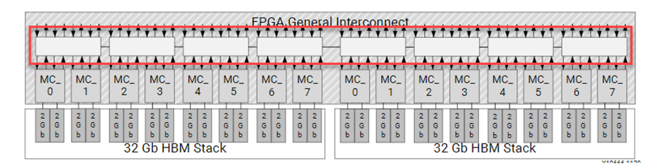

# Introduction
This tutorial covers essential steps how to migrate an existing application using DDR memory to HBM memory.  You begin this tutorial by explaining the structural differences between DDR and achievable theoratical bandwidth. The next section uses a simple example with necessary steps to migration an application from DDR to HBM. 

# Before You Begin

>**TIP**: This tutorial takes approximately two hours to complete.

The labs in this tutorial use:

* BASH Linux shell commands.
* 2020.2 Vitis core development kit release and the *xilinx_u200_xdma_201830_2* platform. If necessary, it can be easily ported to other versions and platforms.

This tutorial guides you to run the designed accelerator on the FPGA; therefore, the expectation is that you have an Xilinx® Alveo™ U200 Data Center accelerator card set up to run this tutorial. Because it can take several (six or seven) hours to generate the multiple `xclbin` files needed to run the accelerator, pregenerated `xclbin` files are provided for the U200 card. To use these pregenerated files, when building the hardware kernel or running the accelerator on hardware, you need to add the `SOLUTION=1` argument. 

>**IMPORTANT:**  
>
> * Before running any of the examples, make sure you have installed the Vitis core development kit as described in [Installation](https://www.xilinx.com/cgi-bin/docs/rdoc?v=2020.1;t=vitis+doc;d=vhc1571429852245.html) in the Application Acceleration Development flow of the Vitis Unified Software Platform Documentation (UG1416).
>* If you run applications on Alveo cards, ensure the card and software drivers have been correctly installed by following the instructions on the [Alveo Portfolio page](https://www.xilinx.com/products/boards-and-kits/alveo.html).

## Accessing the Tutorial Reference Files

1. To access the tutorial content, enter the following in a terminal: `git clone http://github.com/Xilinx/Vitis-Tutorials`.
2. Navigate to the `Port_DDR_to_HBM` directory.
    * `Makefile` under the `makefile` directory explains the commands used in this lab. Use the `PLATFORM` variable if targeting different platforms.
    * `reference_file` contains the modified kernel and host-related files for achieving higher performance.

## Tutorial Overview

1. [HBM Introduction](1_overview.md) : Provides a brief overivew on Structural Differences between DDR and HBM and theoratical maximum bandwidth by HBM.

2. [Migration from DDR to HBM](2_Migrating_to_HBM.md) : Walks through the steps of migrating existing DDR based application to HBM
### 
  

Some algorithms are memory bound, limited by the 77GB/s bandwidth available on DDR based Alveo cards. For those applications there are  HBM (High Bandwidth Memory) based  Alveo cards, providing up to 460 GB/s memory bandwidth.  This chapter will walk you thought some of the structural differences between DDR and HBM and introduce how you can take advantage of the higher bandwidth.

DDR Introduction:

DDR implementations have been used in cards and computers for decades. There is a memory controller in the fpga, that talks across traces on the pcb to an on-card DDR module. The memory controller sees all the memory in the DDR module. For Alveo cards with multiple DDR banks, the FPGA needs to implement a memory controller or each DDR modules used in an application.

HBM introduction:

HBM is a newer memory technology that takes advantage of newer chip fabrication techniques to allow for more bandwidth and more bandwidth/watt that traditional DDR implementations. Memory manufactures use stacked die and through silicon via chip fabrication techniques to stack multiple smaller DDR based memories into a single larger faster memory stack. 

For the Alveo implementation, 2 16-layer HBM (HBM2 specification) stacks are incorporated into the FPGA package - connected into the FPGA fabric with an interposer. The implementation provides

-   8GB HBM memory
-   32 256MB HBM segments - called pseudo channels (PCs)
-   An independent AXI  channel for communication with the FPGA through a segmented crossbar switch per pseudo channel
-   A 2-channel memory controller per 2 PCs
-   14.375 GB/s max theoretical bandwidth per PC
-   460 GB/S ( 32 *14.375 GB/s) max theoretical bandwidth for the HBM subsytem  

Each pseudo channel has a max theoretical performance of 14.375 GB/s, less than the theoretical 19.25 GB/s for a DDR channel. To get better than DDR performance, designs must use multiple AXI masters into the HBM subsystem, efficiently. 

The figure below will help you visualize HBM subsystem and FPGA connectivity from the 32 AXI channels (shown by the 32 pairs of up/down arrows) , into the segmented crossbar switch  (shown by the 8 white boxes highlighted in red),  to the memory controllers leading to the pseudo channels:

The segmented crossbar switch can become the bottleneck impacting an applications actual HBM performance. Lets review the structure of the switch to better understand how to use it. The switch is composed of  8 4x4 switch segments.  The 4x4 segment is detailed below

The fastest connections are from a AXI channel to the memory address of the aligned PC, M0→S0 (0-256MB), M1->S1(256-512MB), and etc. That would limit a design to accessing 32 individual 256MB memory segments. For a performance trade off, the segmented crossbar switch allows any AXI master to access any of the addresses in the 8GB HBM range. If an address is outside the aligned PC it will traverse the segmented crossbar to get to the correct PC, via the local 4x4 connectivity shown above, or traversing to another 4x4 switch on the L/R connections.  Performance will be impacted by two factors

Each connection in the switch has the same bandwidth.
Crossing from 4x4 switch to 4x4 switch increases latency.
 The fastest connections will be from the AXI master to one of the 4 aligned pseudo channels in the same switch.  If multiple masters are spanning the range, the left ↔ right switch structure can become  bandwidth saturated. 

## Next Steps

In the next step, you will follow the instructions how to migrate a DDR based application to HBM. 

<b>
Start the next step: <a href="./Migrate_the_Application.md"> Migrate the application to HBM</a>
</b>

 

<b><a href="/docs/vitis-getting-started/README.md">Return to Getting Started Pathway</a> — <a href="docs/README.md">Return to Start of Tutorial</a></b>

Copyright&copy; 2020 Xilinx

