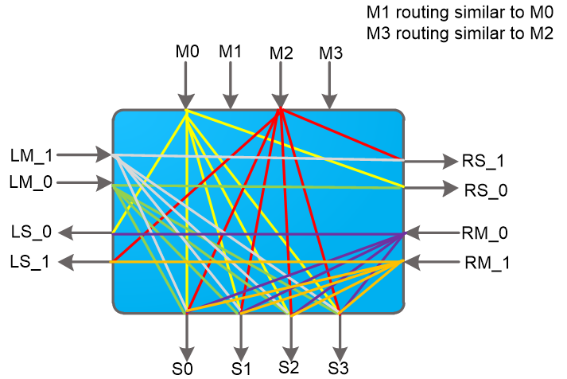

# Intro
This tutorial covers essential steps how to migrate an existing application using DDR memory to HBM memory.  You begin this tutorial by explaining the structural differences between DDR and achievable theoratical bandwidth. The next section uses a simple example with necessary steps to migration an application from DDR to HBM. 

## Tutorial Overview

### Structural Differences between DDR and HBM (Dave)
### HBM usage for achieving better bandwidth than DDR (Dave)
### Theoretical maximum Bandwidth using HBM (Dave)
### How does access patterns affect the BW (stacks/banks)   (Herve)
### Overview of existing Application (Ravi)
### Migration from DDR to HBM (Ravi)
### 
  

Some algorithms are limited by the 77GB/s bandwidth available on DDR based Alveo cards. For those applications there are  Alveo cards with HBM (High Bandwidth Memory) providing up to 460 GB/s memory bandwidth.  This chapter will walk you thought some of the structural differences between DDR and HBM and introduce how you can take advantage of the higher bandwidth.

DDR implementations have been used in cards and computers for decades. There is a memory controller in the fpga, that talks across traces on the pcb to an on-card DDR module. The memory controller sees all the memory in the DDR module. For Alveo cards with multiple DDR banks, the FPGA needs to implement a memory controller or each DDR modules used in an application.

HBM is a newer memory technology that takes advantage of newer chip fabrication techniques to allow for more bandwidth and more bandwidth/watt that traditional DDR implementations. Memory manufactures use stacked die and through silicon via chip fabrication techniques to stack multiple smaller DDR based memories into a single larger faster memory.  Alveo cards have an FPGA with 8 GB memory split into 2 32 Gb (4 GB) HBM stacks. Each stack has 16 2Gb (256 MB) DDR layers known as pseudo channels. There is connectivity from the FPGA to the pseudo channels through 32 AXI masters (shown by the 32 pairs of up/down arrows), into a segmented crossbar switch  (shown by the 8 white boxes), leading to the pseudo channels as shown below:

The switch matrix, highlighted in the red box, is broken up into 8 4x4 switch segments. The 4x4 segment is detailed below

The repeated switch structure allows AXI master 0 (the left most) to access any of the addresses in the 32 pseduo channel HBM range. Latency will increase with each switch crossed, impacting applications doing a lot of random or small memory transfers. Each connection in the switch has the same bandwidth. If multiple masters are spanning the range, the left ↔ right switch structure can become  bandwidth saturated. The fastest connections will be from the AXI master to one of the 4 aligned pseudo channels in the same switch. 

Each pseudo channel has a max theoretical performance of 14.375 GB/s, less than the theoretical 19.25 GB/s for a DDR channel. To get better than DDR performance, designs must use multiple AXI masters efficiently accessing multiple pseudo channels while not saturating the 4x4 switch connectivity.  In the next chapter we will talk about measured HBM performance across different AXI master ↔ psuedo channel access patterns.

The cut line - how get the content below above

This HBM implementation does not support partial memory transfers. The best performance will come from 512 bit aligned memory access

Introduce various possible usages available in the cross-bar, how you are accessing it?
-------------------------------------------------------------------------------------------------------------------------------------------------

## Next Steps

In the next step, you will follow the instructions how to migrate a DDR based application to HBM.

<b>
Start the next step: <a href="./Migrate_the_Application.md"> Migrate the application to HBM</a>
</b>

 

<b><a href="/docs/vitis-getting-started/README.md">Return to Getting Started Pathway</a> — <a href="docs/README.md">Return to Start of Tutorial</a></b>

Copyright&copy; 2020 Xilinx

